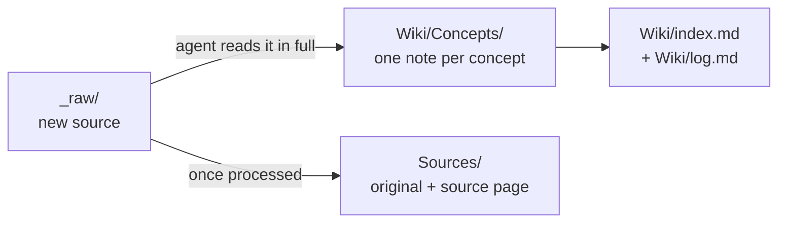

# Obsidian LLM-Wiki Template

An Obsidian vault where an AI agent builds and maintains your knowledge base for you.

Drop a raw source into the vault (lecture slides, a PDF, an article, a transcript, a chat export) and ask the agent to process it. It reads the whole document, extracts the concepts, writes one note per concept and links them to what is already there. Source after source, you end up with a wiki of interlinked notes instead of a pile of files.

> **Language note:** the agent's rules ([`CLAUDE.md`](CLAUDE.md)) and the note templates are written in French. Agents follow them whatever language you use, and each note keeps the language of its source. Ask your agent to translate them if you prefer English.

## The idea: Andrej Karpathy's "LLM Wiki"

This vault follows the **LLM Wiki** pattern described by [Andrej Karpathy](https://karpathy.ai/) (former Director of AI at Tesla, founding member of OpenAI) in a [GitHub Gist](https://gist.github.com/karpathy) in April 2026.

With classic RAG, an AI searches raw documents every time you ask a question and rebuilds its answer from scratch. An LLM Wiki works the other way around: the model **compiles the knowledge once, when a source comes in**. It writes the articles, connects related ideas and keeps everything organized. What you get is a wiki that you can read yourself and that the AI can reuse later.

On top of that pattern, this template adds:
- an **inbox** (`_raw/`) kept separate from the **archive** (`Sources/`), where Karpathy uses a single `raw/` folder for both;
- three note types (concepts, summaries, project contexts), each with its own template;
- an **index** and a **log** the agent updates every session;
- a strict **rigor rule**: read every source in full, never fill gaps with outside knowledge, and split concepts as finely as they deserve.

## How it works



The full rules live in [`CLAUDE.md`](CLAUDE.md). The agent handles three operations.

### Ingest: turn a source into notes

Drop a file into `_raw/` and ask *"process the files in `_raw/`"*. The agent then:
1. reads the document **in full**, not a sample;
2. lists the concepts it contains;
3. checks `Wiki/Concepts/` for each one:
   - **existing note**: it adds the new source and fills in what was missing;
   - **note you reviewed** (`reviewed: true`): it leaves your text alone and only appends a dated section;
   - **contradiction**: it flags it with a `> [!conflict]` callout instead of picking a side;
   - **new concept**: it creates an atomic note;
4. links the notes together with `[[wikilinks]]`;
5. writes a **source page** (summary + list of the notes it touched) and moves the file to `Sources/`;
6. updates `Wiki/index.md` and adds an entry to `Wiki/log.md`.

### Query: keep the good answers

When a question leads to a real synthesis (a comparison, an analysis, links between several notes), the agent offers to save it in `Wiki/Summaries/`. Your questions grow the wiki just like your sources do.

### Lint: keep the wiki healthy

Ask *"lint the wiki"* and the agent reports unflagged contradictions, outdated statements, orphan notes, concepts that deserve their own note, and missing links. It suggests fixes and waits for your approval.

### Principles

- **One note, one concept.** No catch-all "chapter" notes.
- **Faithful to the source.** Nothing is invented or filled in from general knowledge.
- **You have the last word.** Reviewed notes are protected, and nothing is deleted or renamed without your approval.
- **Always traceable.** `index.md` matches the vault's real content, and `log.md` records every operation.
- **Self-documenting.** When the structure changes, the agent updates `CLAUDE.md` to match.

## Obsidian in two minutes

[Obsidian](https://obsidian.md) is a free note-taking app for Mac, Windows, Linux, iOS and Android. Notes are **plain Markdown files** on your disk: no proprietary format and no mandatory cloud, so any tool can read them, AI agents included. Obsidian is where you read and browse, and the agent edits the files directly.

What you need to know for this vault:
- **Vault**: a folder opened in Obsidian. This repo is one.
- **Wikilinks**: `[[Note name]]` links to another note. This is how concepts connect.
- **Backlinks**: every note lists the notes that point to it.
- **Graph view**: a map of your notes, a nice way to watch the wiki grow.
- **Properties**: the YAML block between `---` at the top of a note (type, tags, sources, review status…).
- **Callouts**: highlighted blocks such as `> [!important]` or `> [!conflict]`.
- **Math**: LaTeX with `$...$` inline or `$$...$$` as a block.

## Vault structure

```
.
├── CLAUDE.md            rules the agent follows
├── _raw/                inbox: files waiting to be processed
├── Sources/             processed originals + their source pages
├── Templates/
│   ├── Reference.md     concept notes
│   ├── Summary.md       summaries
│   ├── Project.md       project contexts
│   └── Source Page.md   source pages
├── Wiki/                everything the agent writes
│   ├── Concepts/        one atomic note per concept
│   ├── Summaries/       summaries and saved answers
│   ├── Projects/        project contexts
│   ├── index.md         catalog of every note
│   └── log.md           append-only history of operations
└── .claude/skills/      Obsidian skills for the agent (Markdown, Bases, Canvas, CLI)
```

## Which AI agent?

Any agent that can read and write local files will do. The vault was built and tested with [Claude Code](https://claude.com/claude-code), which loads `CLAUDE.md` automatically, but nothing in the rules is tied to a specific model.

- [Hermes Agent](https://github.com/NousResearch/hermes-agent) (Nous Research, open source, MIT) also loads `CLAUDE.md` automatically.
- [Obsidian Copilot](https://github.com/logancyang/obsidian-copilot) in Agent mode runs from inside Obsidian.
- Agents that expect an `AGENTS.md` file, such as Codex, can use a symlink: `ln -s CLAUDE.md AGENTS.md`. Any other agent just needs to be told to read `CLAUDE.md` first.

## Getting started

1. Clone the repo or download it as a ZIP (**Code → Download ZIP**):
   ```
   git clone https://github.com/marcchend/Obsidian-LLM-Wiki-Template.git
   ```
2. In Obsidian, choose *Open folder as vault* and select the folder.
3. Start your agent at the root of the vault.
4. Drop a first file into `_raw/` and ask: *"process the files in `_raw/`"*.

**Optional:**
- Install `poppler` (`brew install poppler` on macOS) so the agent can read PDFs page by page.
- For agents that look for skills in `.agents/`, add a symlink: `ln -s ../.claude/skills .agents/skills`.

## Customization

Everything is meant to be adapted: templates, note types, naming conventions. Describe the change to your agent; it applies it, updates `CLAUDE.md` and logs it in `Wiki/log.md`. To add a note type, create a subfolder in `Wiki/` together with its template in `Templates/`.

## Privacy

The `.gitignore` already leaves out personal configuration: the Obsidian workspace, plugin data (which often contains **API keys**), local agent settings and Copilot's internal folders.

⚠️ **Your notes and sources are versioned by default.** If they are private or copyrighted (course material, books…), keep your repository **private**, or uncomment the `_raw/` and `Sources/` lines in `.gitignore`.

## Credits

- **LLM Wiki** pattern: [Andrej Karpathy](https://gist.github.com/karpathy).
- Obsidian skills in `.claude/skills/`: [kepano/obsidian-skills](https://github.com/kepano/obsidian-skills) by Steph Ango, MIT license.
